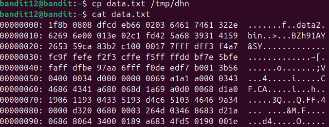
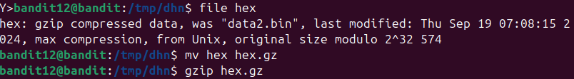
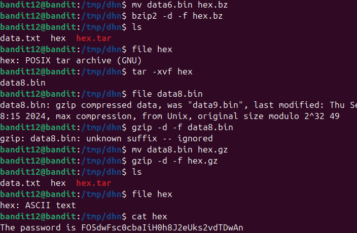

Sau khi tạo file và chuyển data.txt đến /tmp/dhn như hướng dẫn và nhận thấy file có kí tự hex

Kiểm tra dạng file thì có thông tin là gzip, chuyển thành hex.gz sau đó giải nén

Sau đó được nén dạng bzip2, làm tương tự đến khi hết

