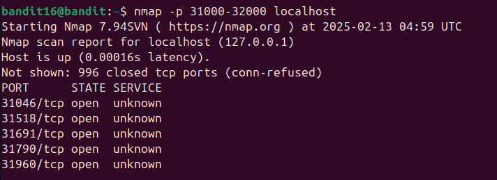

Đề bài có đề cập về tìm xem port nào đang nghe và sử dụng SSL/TLS 
Tra gg thì có thể dùng nmap

Thấy xuất hiện 5 cổng nhưng service unknown
=> phải thử từng port
ncat --ssl localhost <port>
Tìm được key ở port 31790