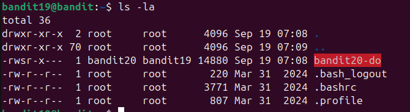

Kiểm tra thì thấy có file bandit20-do bôi đỏ\
Dùng file để xem có gì => file executable

Phần phân quyền của user bandit20 là rws (file để chạy quyền bandit20)\
Chạy file /etc/bandit_pas/bandit20 với bandit20-do để lấy pass