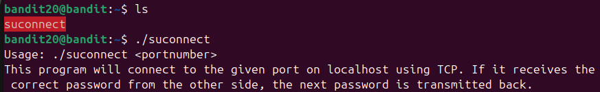
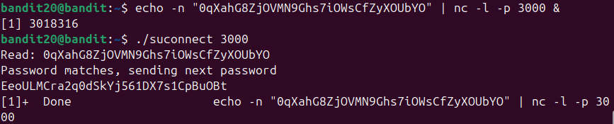

Chạy file suconnect thì thấy mô tả như ảnh

=> Phải tạo 1 port để nghe (-l) sau đó chạy file suconnect để lấy thông tin từ port đó

(echo -n "0qXahG8ZjOVMN9Ghs7i0WsCfZyX0UbYO" | nc -l -p 1234 &\
&: để tác vụ chạy background)
