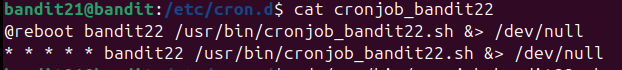
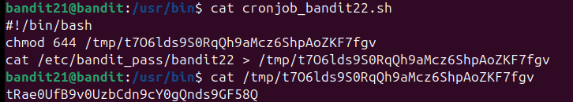

Theo đề bài xem /etc/cron.d có gì
Cat thấy 1 đường dẫn được thực thi khi khởi động

Xem file đó thì thấy làm 2 việc là set quyền cho file /tmp/ và chuyển nội dung file /etc vào /tmp
Cat thử file /tmp và được pass

