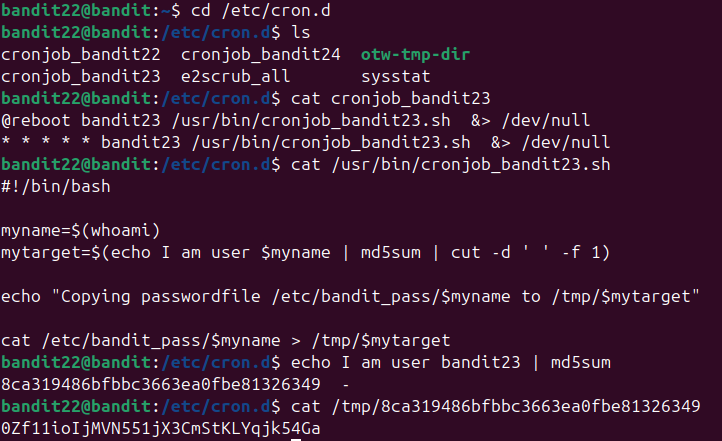

Mở thư mục theo đề sau đó cat file bandit23 thì thấy có file cronjob_bandit23.sh\
Kiểm tra thì thấy 1 script lệnh\
Thử làm theo là chuyển "I am user bandit23" thành md5 để làm tên file chứa pass\
Sau đó cat /tmp/md5 \

