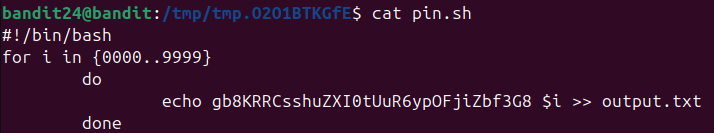
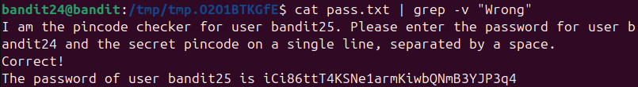

Đề bài bảo kết nối tới port 30002 và gửi pass bandit24 kèm theo 1 pincode 4 số thì sẽ nhận được bandit25\
Ý tưởng là thay vì chạy lần lượt từng số do quá lâu nên sẽ truyền tất cả trường hợp vào nc\
Tạo 1 file .sh để có những trường hợp khả thi

Sau khi nc vào port 30002 thu được kết quả vào file pass.txt nhưng thấy Wrong bị lặp lại nhiều\
=> Dùng grep -v để loại những ký tự ko mong muốn 

