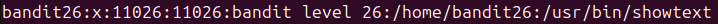
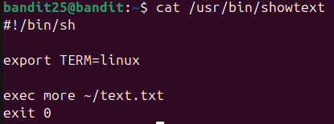
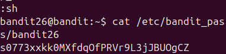

ls thấy file key của bandit26 nhưng sau khi thử ssh thì lập tức bị văng ra
Tìm vào file /etc/passwd để xem user bandit26

Tìm hiểu về more thì thấy nó là 1 dạng sách khi lật hết các trang thì mới tính là thực thi xong
=> Thu nhỏ màn hình terminal lại để ngăn more chạy xong
Sau khi ssh được thì dùng vim set shell=/bin/bash sau đó cat file bandit26 để lấy pass

