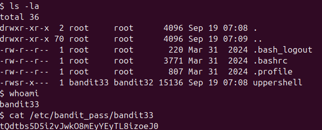

Nhận thấy là mọi kí tự nhập vào đều bị viết in hoa \
Thử tìm hiểu thì thấy dùng "$0" để thoát \
ls ra file uppershell nhưng có vẻ là 1 file chương trình \
Check ls -la thì thấy bandit33 owner file này và có setuid \
cat file bandit33 và được pass \

